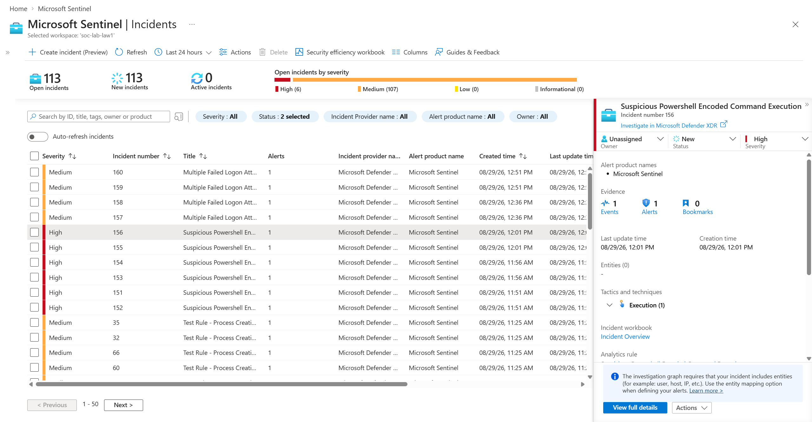
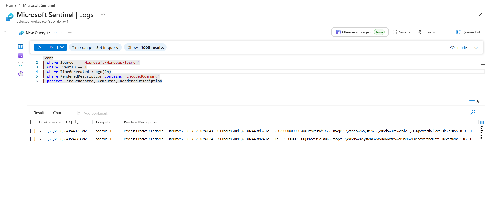

# Detection 2 - Suspicious PowerShell Encoded Command

## Objective
Detect PowerShell execution with encoded commands (-EncodedCommand flag) to catch obfuscated malware.

## Why This Matters
- Attackers encode commands to hide them from detection
- Legitimate PowerShell rarely uses encoding
- High confidence indicator of malicious activity

## Data Source
Sysmon Event Logs

## Event ID
**1** - Process creation (Sysmon)

## KQL Query

```kql
Event
| where Source == "Microsoft-Windows-Sysmon"
| where EventID == 1
| where TimeGenerated > ago(30m)
| where RenderedDescription contains "EncodedCommand"
| project TimeGenerated, Computer, RenderedDescription
```

## How It Works
1. Filters for Sysmon process creation events
2. Searches for "EncodedCommand" flag in the description
3. Looks back 30 minutes
4. Returns time, computer, and command details

## MITRE ATT&CK
- **Tactics:** Execution, Defense Evasion
- **Techniques:** Command and Scripting Interpreter (T1059.001), Obfuscated Command Line (T1027.010)

## Severity
**High** - Encoded PowerShell is rarely legitimate

## Investigation Steps

1. **Extract the base64 string** - Copy the encoded command from the alert
2. **Decode it** - Use PowerShell to decode and read what it actually does
3. **Check parent process** - Who launched PowerShell?
4. **Analyze the decoded command** - Does it download files? Execute code? Modify system?
5. **Take action** - Close if legitimate admin task, isolate if suspicious

## Screenshots




